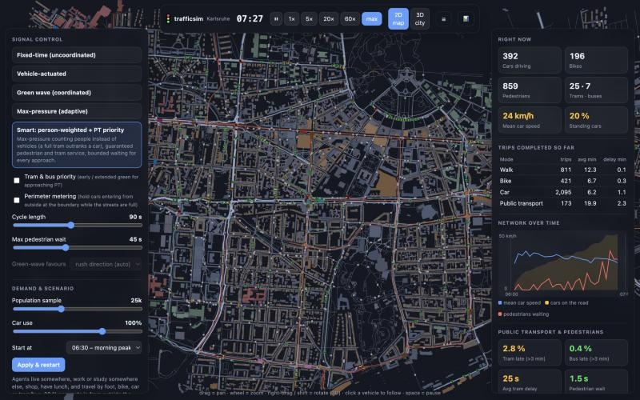
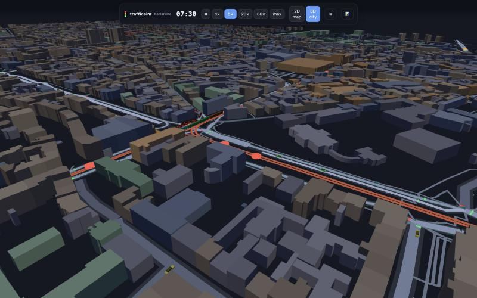

# trafficsim · Karlsruhe

A multimodal traffic simulation of Karlsruhe's inner city that runs entirely in the browser. Cars, buses, trams, bikes and pedestrians move on the **real street network from OpenStreetMap**, obey traffic lights and right-of-way, and follow **daily plans** (home → work/school → lunch → shopping → home). You can switch the signal-control strategy while it runs – fixed-time, vehicle-actuated, *grüne Welle*, max-pressure, or a "smart" controller – turn tram priority on, close roads, and see what happens to cars, trams, bikes and people on foot. Explore it as a 2D map or fly around the 3D city.





## Run it

```bash
npm install
npm run dev          # http://localhost:5173
```

The network (`public/data/karlsruhe.json`, 5 MB) is committed, so nothing else is needed. A full simulated day (05:00–24:00, ~25 000 people, ~60 000 trips) takes ~30 s to compute headless, so the viewer can run at up to ~200× real time.

| Controls | |
|---|---|
| drag / wheel | pan / zoom (in 3D: drag rotates, right-drag pans) |
| click a vehicle or pedestrian | follow it (Esc to release) |
| click a traffic light | see its phases, queues and waiting pedestrians |
| `space` · `1`–`5` · `V` · `H` | pause · speed · 2D/3D · hide panels |

## What is simulated

**World.** 4.6 × 2.8 km around the Marktplatz (Hauptbahnhof ↔ Durlacher Tor ↔ Mühlburger Tor): ~5 100 directed car edges (271 km of lanes-aware road with speed limits, one-ways, roundabouts and tunnels), ~260 signalised junctions and crossings, 1 270 tram track edges, 9 000 footways/sidewalks/crossings, 11 000 buildings (extruded), 149 stops and 39 tram/bus lines (OSM route relations). Zebra crossings and signalised crossings are real OSM nodes.

**People.** A synthetic population (default 25 000 agents): residents who work, study or run errands, plus commuters from outside the map who enter and leave through the boundary roads, and some pure through-traffic. Homes, workplaces, schools and shops are sampled from building footprints and POIs with a gravity model. Every agent has a plan with departure times (rush-hour peaks, lunch walks, evening errands) and chooses **walk / bike / car / public transport** by trip distance. PT trips walk to a stop, wait, board the right line, may transfer once, alight and walk on.

**Vehicles.** Car-following with the Intelligent Driver Model per lane; look-ahead through several junctions; turn speeds; per-driver variation. Buses and trams stop at every stop (dwell time grows with boarding), trams are 26–45 m long, buses 12 m. Bikes use their own lane on every street (and cycleways) so they can pass queues but obey signals. Routing is congestion-aware A\* (edge speeds are tracked and drivers re-route around jams and closed streets).

**Junctions.** Every junction has movement-level conflicts (computed from geometry), a box-clearing rule, right-before-left / priority-road / roundabout / tram-priority right-of-way, permissive left turns, and protection against blocking the box. Neighbouring OSM nodes of one real intersection (dual carriageways, separate signal heads) are merged into one junction when the network is built.

**Pedestrians.** They walk on the walking graph, **wait at kerbs**, cross when the signal allows (or accept a gap at unsignalised crossings, zebras give them priority), and cars hold while they cross. Their waiting is measured.

**Signals.** Phases are generated from junction geometry (opposing arms are grouped). Pedestrian-only and tram-only stages are call-actuated. Strategies (all in [`src/sim/signals.ts`](src/sim/signals.ts)):

| Strategy | Idea |
|---|---|
| **Fixed-time** | Plan with demand-proportional splits, random offsets – an un-tuned network (the baseline) |
| **Vehicle-actuated** | Detectors extend green while vehicles arrive and skip empty phases |
| **Green wave** | Common cycle, offsets along arterials from the centre – direction follows the rush hour (inbound in the morning) |
| **Max-pressure** | Serve the phase with the largest queue pressure, discounted by full exit links |
| **Smart** | Gap-out control that counts **people** (a full tram outranks a car), pre-empts for trams/buses, skips phases whose exits are full, bounds waiting of every approach and of pedestrians |

Extra levers: **tram & bus priority**, **perimeter metering** (hold cars entering from outside while the streets are full), cycle length, pedestrian maximum wait, city-wide speed limit, **closing roads**.

## Results

Same population, same morning (06:30–09:30), 25 000 agents, mean of 3 simulation seeds. *Delay* = actual minus free-flow travel time for the trip. Teleports count vehicles that sat in a gridlock for 5 min and were moved on (SUMO-style; each adds a 10 min penalty to that trip's delay).

| Strategy | car delay (mean) | car delay p90 | bike delay | PT door-to-door delay | pedestrian wait/crossing | tram late > 3 min | people-hours lost | teleports |
|---|---:|---:|---:|---:|---:|---:|---:|---:|
| Fixed-time | 269 s | 692 s | 166 s | 223 s | 5.7 s | 6.4 % | 786 | 71 |
| Vehicle-actuated | 111 s | 225 s | 46 s | 181 s | 1.6 s | 3.9 % | 339 | 25 |
| Green wave | 264 s | 638 s | 166 s | 230 s | 5.8 s | 7.4 % | 779 | 71 |
| Max-pressure | 100 s | 221 s | 67 s | 184 s | 3.2 s | 3.3 % | 347 | 14 |
| **Smart** | **95 s** | **207 s** | **41 s** | **180 s** | **1.5 s** | 3.7 % | **305** | 24 |

What the experiments say (for *this model*; see the caveats below):

* Replacing fixed-time plans by **any demand-responsive control cuts car delay by ~60 %** and bike/pedestrian/PT delay even more. Most of the gain is simply not wasting green on empty approaches.
* A **green wave alone barely helps** in a dense, grid-like centre with heavy cross traffic and trams: platoons break up at every other junction. It pays off only on long arterials without much side demand.
* **Smart** is best for cars, bikes, PT passengers and pedestrians, but only slightly better than plain actuation for cars; its advantage is mostly for pedestrians, bikes, buses and trams and its bounded waiting. Max-pressure has marginally fewer late trams and gridlocks.
* **Tram priority** is a trade: with fixed plans it halves late trams (6.4 → 2.7 %) and costs cars ~30 s each; adaptive controllers get most of the benefit for free.
* Beyond a certain demand (38 000 agents) the network **gridlocks whatever the lights do**; signals cannot fix spill-back. *Perimeter metering* then keeps the inside moving (smart control: bike delay 236 → 83 s, PT 248 → 196 s, gridlock teleports 273 → 78) by making outside commuters wait at the boundary – a policy trade-off, not a free lunch (≈ 2 000 fewer car trips complete in the window).

Reproduce with `npm run benchmark -- 25000 6.5 3 0 fixed,actuated,greenwave,maxpressure,smart 1,2,3` (agents, start hour, hours, tram priority 0/1, strategies, seeds). Results are also embedded in the UI.

## Architecture

```
scripts/fetch-osm.mjs      Overpass download (bbox around the Innenstadt)
scripts/build-network.ts   OSM → network: graph, junction joining, tram/road crossings, stops & lines
public/data/karlsruhe.json the processed network (committed)
src/sim/                   the simulation (no DOM dependency, runs in Node and the browser)
  engine.ts                  IDM car following, junction logic, right of way, teleports, PT dwell
  signals.ts                 phase generation and the control strategies
  peds.ts  transit.ts        pedestrians; lines, timetables, boarding, transfers
  demand.ts                  synthetic population and daily plans
  sim.ts                     orchestration, routing, metering, metrics
src/render/world.ts        Three.js scene (2D ortho map / 3D perspective), instanced traffic
src/main.ts  src/ui/       panels, charts, interaction
scripts/benchmark.ts       strategy comparison;  headless.ts, debug-*.ts  diagnostics
```

Rebuild the data yourself: `npm run fetch-osm && npm run build-network`.

## Honest limitations

* **Demand is synthetic.** There are no public full-resolution traffic counts for Karlsruhe, so trips are generated from buildings, POIs and typical German mobility patterns (modal split, commute times). The population is a sample; with the fixed-time baseline, 25 k agents give about +45 % travel time in the peak, a plausible order of magnitude for a congested German city, but the model is **not calibrated to measured flows**. Treat the numbers as comparisons between strategies, not predictions.
* **Signal plans are generated**, not the real ones (those are not public). Real Karlsruhe signals are traffic-adaptive with tram priority; the *fixed-time* baseline here is deliberately naive.
* Timetables use typical headways by time of day (peak 7.5 min for trams, 10–20 for buses), not the KVV/AVG GTFS. Only OSM lines with ≥ 2 stops inside the map are included, journeys allow one transfer.
* Simplifications: no lane changing (cars choose a lane when entering an edge), no parking search, no turn lanes/phases, no bus lanes, pedestrians do not interact with each other, bikes never block cars. Network edge cases (very large merged junctions) can still gridlock briefly; such vehicles are teleported and counted.
* Only the inner city is covered (4.6 × 2.8 km); the rest of Karlsruhe is represented by the boundary gates.

## Roadmap ideas

KVV GTFS timetables · calibration against counts (e.g. Mobilithek / Karlsruhe open data) · lane-level signal phases and turn lanes · bus lanes and bike-lane scenarios · whole-city network · web-worker simulation and replay.

## Data & licence

Map data © [OpenStreetMap contributors](https://www.openstreetmap.org/copyright) (ODbL). Code: MIT, see [LICENSE](LICENSE).
